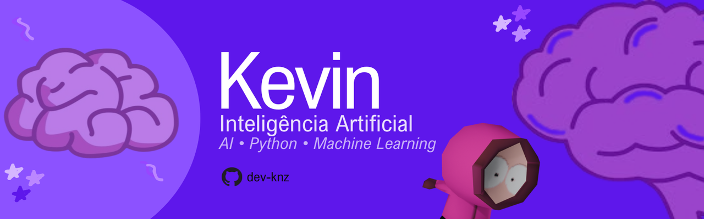

<h1>Hi there, I am Kevin!</h1>

#

<h3 align="center">Estudante de Inteligência Artificial na Universidade Federal de Mato Grosso do Sul (FACOM)

#

<h3> Redes sociais:</h3>

<h3> Linguagens and Frameworks: </h3>

#

<picture align="center">
  <source media="(prefers-color-scheme: dark)" srcset="https://raw.githubusercontent.com/dev-knz/dev-knz/output/github-contribution-grid-snake-dark.svg">
  <source media="(prefers-color-scheme: light)" srcset="https://raw.githubusercontent.com/dev-knz/dev-knz/output/github-contribution-grid-snake-dark.svg">
  
</picture>
